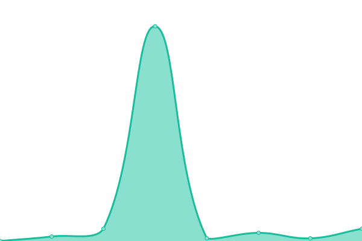

# [📈 Live Status](https://uptime.jawara.cloud): <!--live status--> **🟩 All systems operational**

This repository contains the open-source uptime monitor and status page for [Upptime](https://upptime.js.org), powered by [Upptime](https://github.com/upptime/upptime).

With [Upptime](https://upptime.js.org), you can get your own unlimited and free uptime monitor and status page, powered entirely by a GitHub repository. We use [Issues](https://github.com/upptime/upptime/issues) as incident reports, [Actions](https://github.com/jawaracloud/upptime/actions) as uptime monitors, and [Pages](https://uptime.jawara.cloud) for the status page.

<!--start: status pages-->
<!-- This summary is generated by Upptime (https://github.com/upptime/upptime) -->
<!-- Do not edit this manually, your changes will be overwritten -->
<!-- prettier-ignore -->
| URL | Status | History | Response Time | Uptime |
| --- | ------ | ------- | ------------- | ------ |
|  [Landing Page](https://jawara.cloud) | 🟩 Up | [landing-page.yml](https://github.com/jawaracloud/uptime/commits/HEAD/history/landing-page.yml) | 

 165ms
     
 | 

<a href="https://uptime.jawara.cloud/history/landing-page">100.00%</a>
    

|  [The Overflow Bot](https://the-overflow-bot.jawaracloud.workers.dev/ping) | 🟩 Up | [the-overflow-bot.yml](https://github.com/jawaracloud/uptime/commits/HEAD/history/the-overflow-bot.yml) | 

 883ms
     
 | 

<a href="https://uptime.jawara.cloud/history/the-overflow-bot">100.00%</a>
    

|  [Landing Page Jawara Group](https://jawaragroup.co) | 🟩 Up | [landing-page-jawara-group.yml](https://github.com/jawaracloud/uptime/commits/HEAD/history/landing-page-jawara-group.yml) | 

 120ms
     
 | 

<a href="https://uptime.jawara.cloud/history/landing-page-jawara-group">100.00%</a>
    

|  [Landing Page Teman Hanan](https://hanan.live) | 🟩 Up | [landing-page-teman-hanan.yml](https://github.com/jawaracloud/uptime/commits/HEAD/history/landing-page-teman-hanan.yml) | 

 363ms
     
 | 

<a href="https://uptime.jawara.cloud/history/landing-page-teman-hanan">100.00%</a>
    

|  [Islamic Wedding Invitation Website](https://islamic-wedding-invitation.vercel.app/) | 🟩 Up | [islamic-wedding-invitation-website.yml](https://github.com/jawaracloud/uptime/commits/HEAD/history/islamic-wedding-invitation-website.yml) | 

 123ms
     
 | 

<a href="https://uptime.jawara.cloud/history/islamic-wedding-invitation-website">100.00%</a>
    

<!--end: status pages-->

[**Visit our status website →**](https://uptime.jawara.cloud)

## 📄 License

- Powered by: [Upptime](https://github.com/upptime/upptime)
- Code: [MIT](./LICENSE) © [Anand Chowdhary](https://anandchowdhary.com), supported by [Pabio](https://pabio.com)
- Data in the `./history` directory: [Open Database License](https://opendatacommons.org/licenses/odbl/1-0/)
